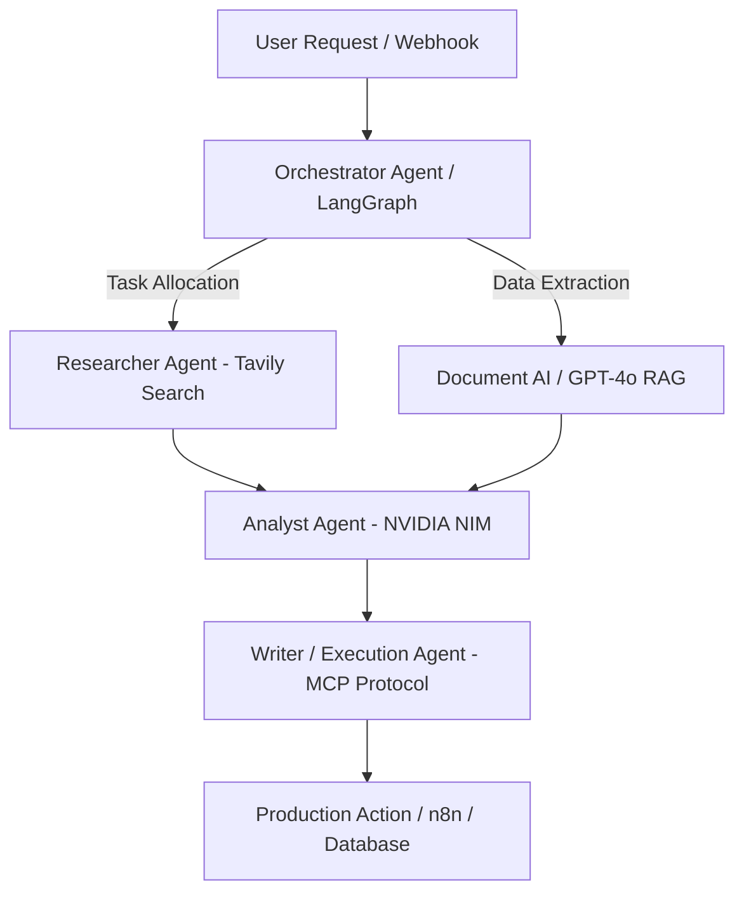

<div align="center">


<br/>

[](https://github.com/Anoopshukla-AI)
[](https://github.com/Anoopshukla-AI)
[](https://github.com/Anoopshukla-AI)

</div>

---

## 🚀 About Me

```yaml
Name     : Anoop Shukla
Role     : AI Automation Engineer | Senior AI Engineer
Location : Lucknow → Open to Gurugram / Delhi NCR
Exp      : 2 years AI + 7 years Enterprise IT
Focus    : Multi-Agent Systems, RAG Pipelines, Workflow Automation
Looking  : Full-time On-roll Roles
```

---

## 🏗️ Multi-Agent Architecture Blueprint



---

## 🛠️ Tech Stack

<div align="center">


</div>

---

## 📊 GitHub Stats

<div align="center">


</div>

<div align="center">

[](https://git.io/streak-stats)

</div>

---

## 🏆 GitHub Trophies

<div align="center">

[](https://github.com/ryo-ma/github-profile-trophy)

</div>

---

## 🔥 Featured Projects

| Project | Description | Tech |
|---|---|---|
| [🤖 mcp-copilot-a2a](https://github.com/Anoopshukla-AI/mcp-copilot-a2a) | Multi-agent pipeline — Researcher → Analyst → Writer via MCP + A2A | LangGraph, NVIDIA NIM, ChromaDB |
| [🏦 AI-Loan-Processing](https://github.com/Anoopshukla-AI/AI-Loan-Processing-Automation-) | Document AI + GPT-4o risk scoring, 10k+ docs/month | FastAPI, OpenAI, Docker |
| [🎯 AI-Career-Copilot](https://github.com/Anoopshukla-AI/AI-Career-Copilot) | Automated job search, resume tailoring & application pipeline | n8n, Claude, Python |
| [🛡️ enterprise-ai-control-plane](https://github.com/Anoopshukla-AI/enterprise-ai-control-plane) | LLM gateway with JWT, RBAC, audit logs — cut cloud spend 20% | FastAPI, Redis, PostgreSQL |
| [📊 AIRADAR](https://github.com/Anoopshukla-AI/AIRADAR) | AI-powered competitive intelligence radar | LangChain, Tavily, Streamlit |
| [⚡ n8n-automation-portfolio](https://github.com/Anoopshukla-AI/n8n-automation-portfolio) | 8 production workflows automating 70% of repetitive tasks | n8n, OpenAI, Webhooks |

---

## 🐍 Contribution Snake

<div align="center">

<picture>
  <source media="(prefers-color-scheme: dark)" srcset="https://raw.githubusercontent.com/Anoopshukla-AI/AnoopShukla-AI/output/github-contribution-grid-snake-dark.svg">
  <source media="(prefers-color-scheme: light)" srcset="https://raw.githubusercontent.com/Anoopshukla-AI/AnoopShukla-AI/output/github-contribution-grid-snake.svg">
  
</picture>

</div>

---

## 📫 Connect With Me

<div align="center">

[](https://linkedin.com/in/an-oops)
[](https://twitter.com/An_oops_s)
[](https://github.com/Anoopshukla-AI)

</div>

<div align="center">


</div>
